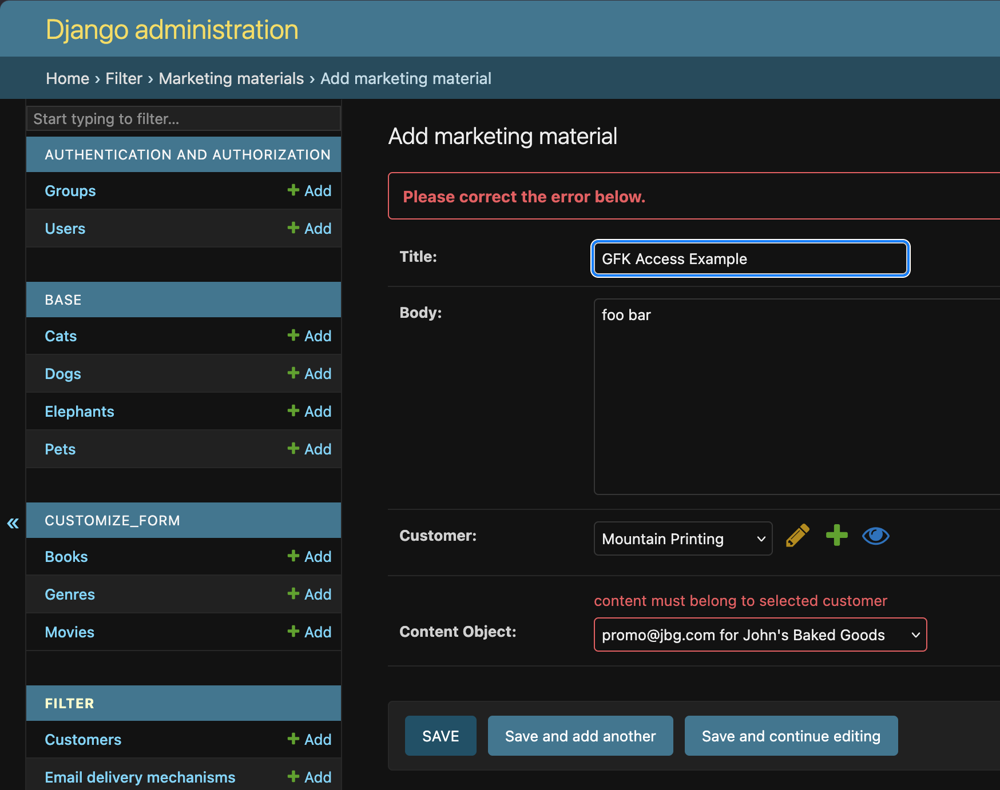

Accessing GFK Objects
=====================

You may find yourself in a situation where you want to interact with the target
instance of the ``GenericForeignKey`` in the form to do extra validation before
saving. Your ``GenericForeignKey`` field will have a dynamic field added with
an autogenerated name.

To access the field you can use the method
``get_generic_field_name_for``. The parameter to this method is the string name
of your ``GenericForeignKey`` field on your model and it returns a string of
the dynamic field name that will be present in the form's ``cleaned_data``.
When you access the field in ``cleaned_data`` the object will be an instance of
the ``GenericRelation`` model.

.. code-block:: python

    class MarketingMaterialAdmin(GenericFKModelForm):

        class Meta:
            model = MarketingMaterial
            fields = "__all__"

        def clean(self):
            super().clean()
            customer = self.cleaned_data["customer"]
            content_object_generic_field = self.get_generic_field_name_for("content_object")
            content_object = self.cleaned_data[content_object_generic_field]
            if customer != content_object.customer:
                raise ValidationError(
                    {
                        content_object_generic_field: "content must belong to selected customer"
                    }
                )
            return self.cleaned_data

    @admin.register(MarketingMaterial)
    class MarketingMaterialAdmin(GenericFKAdmin):
        form = MarketingMaterialAdmin

        def filter_callback(
            self,
            queryset: QuerySet,
            obj: MarketingMaterial | None = None,
        ):
            if obj:
                return queryset.filter(customer=obj.customer)
            return queryset

   You are able to interact with the instance of the related object without
   doing any extra queries yourself.
