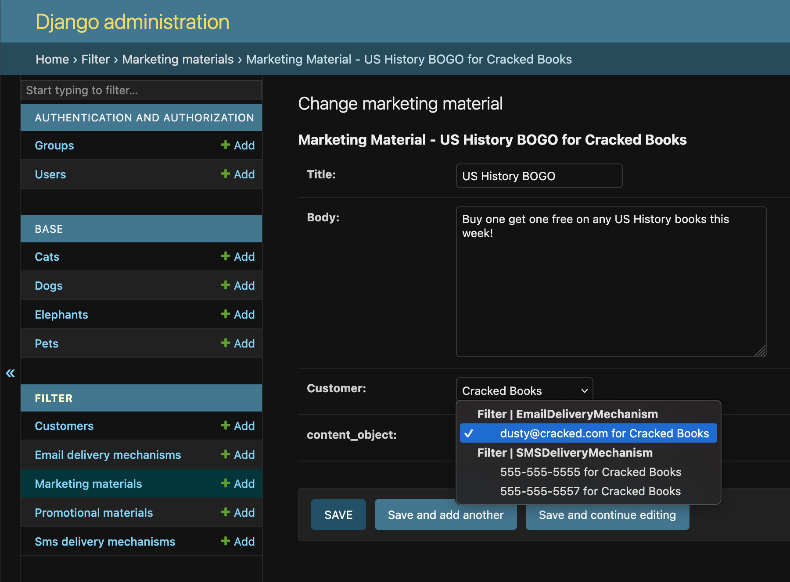

Filtering
=========

You may find yourself in a situation where you want to filter the querysets
of the related models (perhaps by something related to the parent instance of
your model with ``GenericForeignKey`` like a customer or tenant key). You can
define a method on your admin class as follows:

.. code-block:: python

    @admin.register(MarketingMaterial)
    class MarketingMaterialAdmin(GenericFKAdmin):

        def filter_callback(
            self,
            queryset: QuerySet,
            obj: MarketingMaterial | None = None,
        ):
            if obj:
                return queryset.filter(customer=obj.customer)
            return queryset

   Now when loading the change view of the admin, the only options available
   will be for the customer selected for this instance of
   ``MarketingMaterial``.
