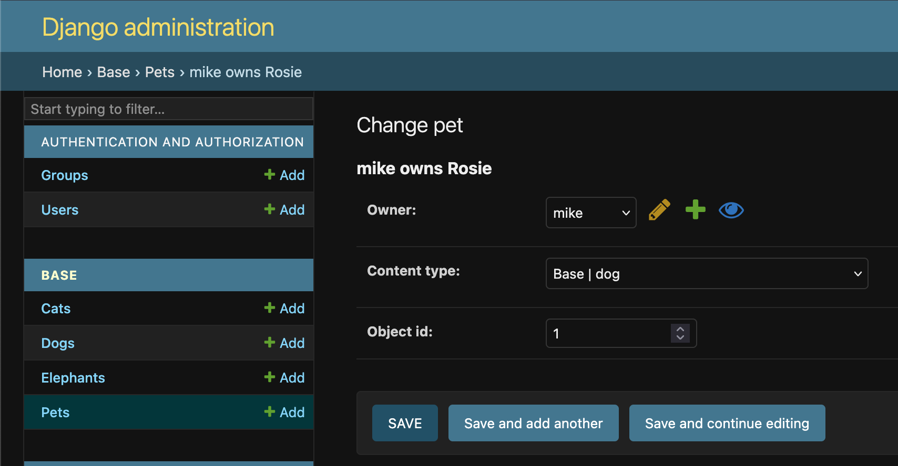
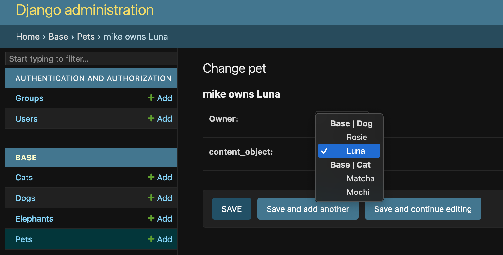

.. Django GenFKAdmin documentation master file, created by
   sphinx-quickstart on Fri Sep 25 08:06:29 2026.

Django GenFKAdmin documentation
===============================

Welcome to the documentation for ``django-genfkadmin``! This package makes it
easier to work with ``GenericForeignKey`` fields from Django in the Django
admin.

The standard experience with ``GenericForeignKey`` fields is very cumbersome as
you get a select widget with all of the ``ContentType`` options for the entire
project and a number input field without much in the way of validation.

   This is an example of the default admin experience.

This project replaces the ``ContentType`` field and object id field with a
single select widget. This widget contains only options for which
``GenericRelation`` fields exist for the ``GenericForeignKey`` to make it
easier to select correct options.

   This is an example of the ``django-genfkadmin`` experience.

.. important::
   This package does not currently support any pagination controls. If you have a
   large number of related models, this is likely to have very poor performance.

.. toctree::
   :maxdepth: 3
   :titlesonly:

   getting_started/index
   advanced_usage/index
   api/index
